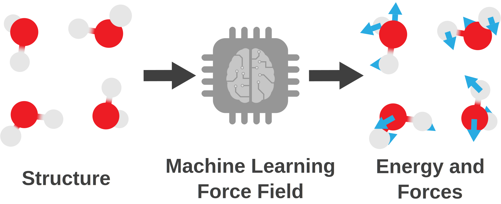
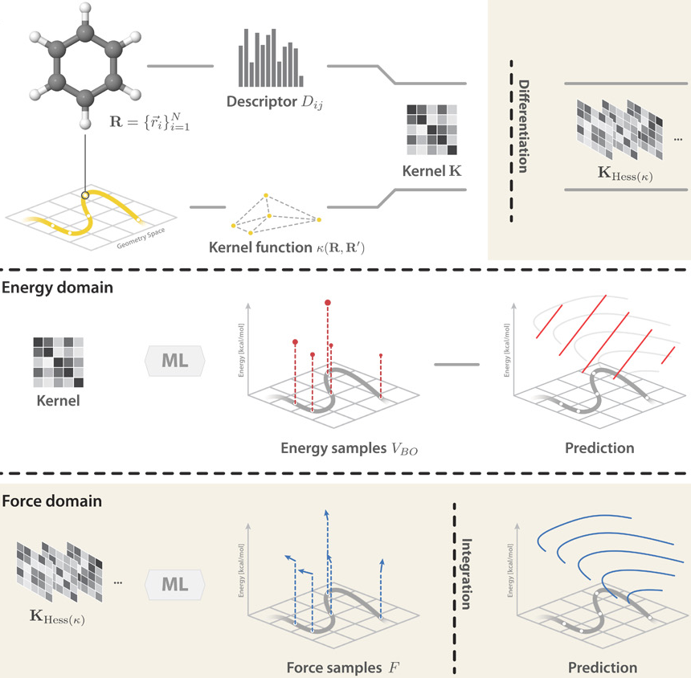

======
mbGDML
======

.. image:: https://github.com/keithgroup/mbGDML/actions/workflows/python-package.yml/badge.svg
   :target: https://github.com/keithgroup/mbGDML/actions/workflows/python-package.yml
   :alt: GitHub actions build status

.. image:: https://codecov.io/gh/keithgroup/mbGDML/branch/main/graph/badge.svg
   :target: https://codecov.io/gh/keithgroup/mbGDML
   :alt: Codecov test coverage

.. image:: https://zenodo.org/badge/DOI/10.5281/zenodo.6270373.svg
   :target: https://doi.org/10.5281/zenodo.6270373
   :alt: DOI

.. image:: https://img.shields.io/lgtm/grade/python/g/keithgroup/mbGDML.svg?logo=lgtm&logoWidth=18
   :target: https://lgtm.com/projects/g/keithgroup/mbGDML/context:python

.. image:: https://img.shields.io/github/license/keithgroup/mbGDML
   :target: https://github.com/keithgroup/mbGDML/blob/main/LICENSE

Many-body, gradient-domain machine learning (mbGDML) is a Python package that can create, use, and analyze machine learning potentials within the many-body expansion framework.

**Disclaimer:** This package is still under active development and not suitable for production.

Motivation
==========

There is often a trade-off between predictive confidence and computational cost with molecular simulations.
Machine learning (ML) force fields attempt to offer a compromise somewhere between quantum chemistry and classical force fields.
However, with ML force fields we often have balance high transferability (i.e., applicability of a trained model to a different system) and the amount of training data.

Using high levels of quantum chemistry (e.g., coupled cluster) dramatically limits the amount of calculations one can reasonably perform.
`Gradient-domain machine learning (GDML) <http://quantum-machine.org/gdml/>`_ is one example of a ML force field designed to be data efficient---only requiring hundreds of training data points.
GDML accomplishes this by learning the fundamental relationship between a geometry and its atomic forces instead of its energy.

   Chmiela, S.; et al. *Sci. Adv.* **2017** *3* (5), e1603015. DOI: `10.1126/sciadv.1603015 <https://doi.org/10.1126/sciadv.1603015>`_

However, GDML is not inherently size or species transferable.
This means changing the number or types of atoms is not allowed after a GDML model is trained---making simulations on arbitrarily sized systems, like solvents, futile.
To circumvent this limitation, we developed a many-body approach where GDML learns *n*-body interactions to have an efficiently trained, transferable ML potential.

.. image:: images/explicit-water-methanol-mbe-allorders.svg
   :width: 350px
   :align: center

Installation
============

You can install mbGDML by using ``pip install mbgdml``.
Or, the latest development version can be installed directly from the `GitHub repository <https://github.com/keithgroup/mbGDML>`_.

.. code-block:: bash

    git clone https://github.com/keithgroup/mbGDML
    cd mbGDML
    pip install .

.. toctree::
   :hidden:

   Many-body expansions <mbe>
   Data and Models <data-and-models/data-formats>
   Training <training>
   Predicting <predicting>
   Tutorials <tutorials/tutorials>
   API <api/modules>
   Contributing <contributing>
