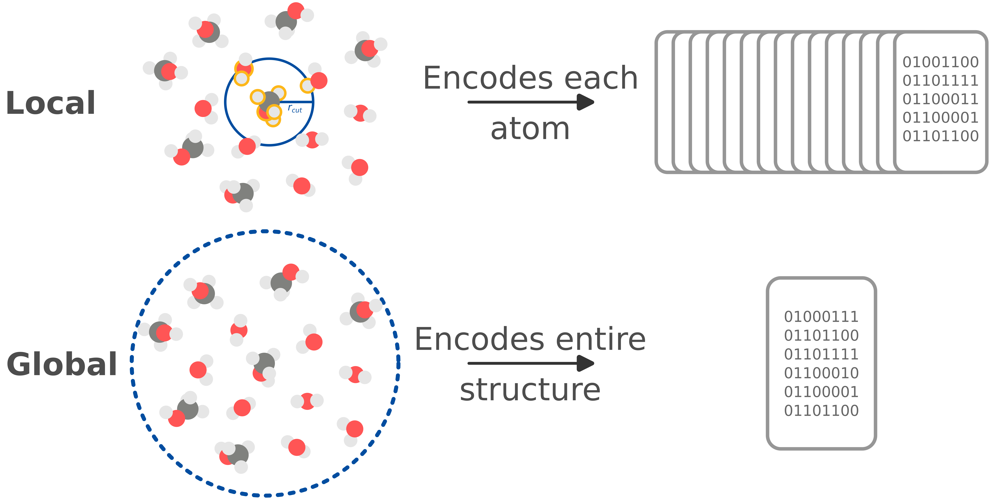
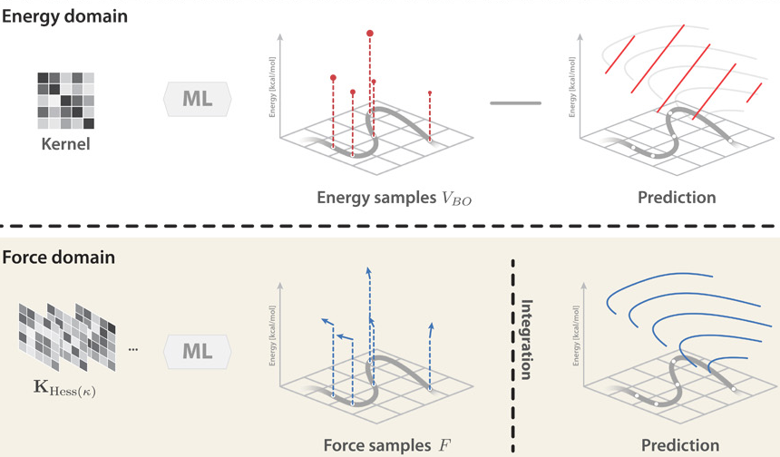
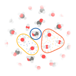

======
mbGDML
======

.. image:: https://github.com/keithgroup/mbGDML/actions/workflows/python-package.yml/badge.svg
   :target: https://github.com/keithgroup/mbGDML/actions/workflows/python-package.yml
   :alt: GitHub actions build status

.. image:: https://codecov.io/gh/keithgroup/mbGDML/branch/main/graph/badge.svg
   :target: https://codecov.io/gh/keithgroup/mbGDML
   :alt: Codecov test coverage

.. image:: https://zenodo.org/badge/DOI/10.5281/zenodo.6270373.svg
   :target: https://doi.org/10.5281/zenodo.6270373
   :alt: DOI

.. image:: https://img.shields.io/github/license/keithgroup/mbGDML
   :target: https://github.com/keithgroup/mbGDML/blob/main/LICENSE

Many-body gradient-domain machine learning (mbGDML) is a Python package that can create, use, and analyze machine learning potentials within the many-body expansion framework.

**Disclaimer:** This package is still under active development and not suitable for production.

Motivation
==========

Machine learning potentials (i.e., force fields) often rely on local descriptors for size transferability.
These descriptors partition total properties into atomic contributions; however, they inherently neglect complicated long-range interactions by enforcing atomic radial cutoffs.
Global descriptors encode the entire structure with no cutoffs and can capture interactions at all scales.
However, they are restricted to systems with the same number of atoms.

`Gradient-domain machine learning <http://www.sgdml.org/>`__ (GDML) is one example of a ML potential with a global descriptor.
GDML is unique because it trains directly on forces and recovers total energy through analytical integration.
This provides substantially more information about the potential energy surface (PES) and allows for better interpolation between training data.
As a result, GDML typically only needs 1000 structures to accurately learn energies and forces.

   Chmiela, S.; et al. *Sci. Adv.* **2017** *3* (5), e1603015. DOI: `10.1126/sciadv.1603015 <https://doi.org/10.1126/sciadv.1603015>`__.

To date, GDML has been limited to the exact system it was trained on.
This makes simulations on arbitrarily size systems, like solvents, futile.

Approach
========

Many-body expansions (MBEs) rigorously decomposes total (i.e., supersystem) energies into fundamental *n*-body interactions.
This expansion is formally exact when all *N*-body interactions are accounted for.
In practice, however, it is typically truncated to the third order.
One can then model any system by summing up 1-, 2-, and 3-body contributions.

MBEs driven by GDML potentials trained on *n*-body interactions is a promising approach for size-transferable potentials.
Furthermore, GDML model's remarkable data efficiency enables training on highly accurate quantum chemical methods.

Features
========

Train
-----

- Train GDML models using grid searches, Bayesian optimization, or both on CPUs.
- Custom loss functions.
- Iterative training procedure for automated curation of optimal training sets.

Predict
-------

- Many-body predictions with GDML, `SchNet <https://schnetpack.readthedocs.io/en/stable/>`__, and `GAP <https://libatoms.github.io/GAP/>`__ potentials.
- Parallel GDML predictions with `ray <https://docs.ray.io/en/latest/>`__ from a laptop to multiple nodes.
- Periodic structures with the minimum-image convention.
- Alchemical predictions by tuning out 2- or 3-body contributions of specific entities.

Analysis
--------

- Prediction sets that store decomposed predictions for further analysis.
- Radial distribution functions.
- Cluster and identify problematic (i.e., high error) structures using `sklearn <https://scikit-learn.org/stable/index.html>`__.

Interfaces
----------

- `Atomic Simulation Environment <https://wiki.fysik.dtu.dk/ase/>`__ (ASE) for geometry optimizations, molecular dynamics simulations, and more.

Installation
============

You can install mbGDML from `PyPI <https://pypi.org/project/mbGDML/>`__ by using ``pip install mbGDML``.
Or, the latest development version can be installed directly from the `GitHub repository <https://github.com/keithgroup/mbGDML>`_.

.. code-block:: bash

    git clone https://github.com/keithgroup/mbGDML
    cd mbGDML
    pip install .
   

License
=======

Distributed under the MIT License. See `LICENSE <https://github.com/keithgroup/mbGDML/blob/main/LICENSE>`__ for more information.

.. toctree::
   :hidden:

   Many-body expansions <mbe>
   Training <training>
   Predicting <predicting>
   API <api/modules>
   Contributing <contributing>
