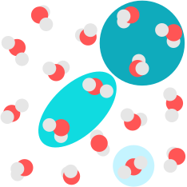

mbGDML
======

.. image:: https://travis-ci.com/keithgroup/mbGDML.svg?branch=master
   :target: https://travis-ci.com/keithgroup/mbGDML

.. image:: https://codecov.io/gh/keithgroup/mbGDML/branch/master/graph/badge.svg
   :target: https://codecov.io/gh/keithgroup/mbGDML

.. image:: https://img.shields.io/lgtm/grade/python/g/keithgroup/mbGDML.svg?logo=lgtm&logoWidth=18
   :target: https://lgtm.com/projects/g/keithgroup/mbGDML/context:python

.. image:: https://img.shields.io/github/license/keithgroup/mbGDML
   :target: https://github.com/keithgroup/mbGDML/blob/master/LICENSE

Many-body gradient domain machine learning (mbGDML) is a Python package that
assists with creating, using, and analyzing sGDML force
fields for many-body interactions.

**Disclaimer:** This package is still under active development and is not ready
for production.

Why?
====

`Symmetric gradient domain machine learning (sGDML)
<http://quantum-machine.org/gdml/>`_ force fields are trained with the
gradient of a kernel ridge estimator on interatomic forces. While this provides
efficient reconstruction of potential energy surfaces with only hundreds of data
points they are nontransferable to systems with differing number of atoms.
Thus, any attempt to model arbitrarily sized systems---say a solvent---would be
futile. Breaking the *n*-sized system into many-body contributions provides
a route to circumvent these limitations. For example, this system of 17 water
molecules could be effectively represented as a combination of 1-, 2-, and
3-body contributions. mbGDML provides the framework to do just that.

.. toctree::
   :hidden:

   install
   tutorials/tutorials
   API <doc/modules>
   contributing
