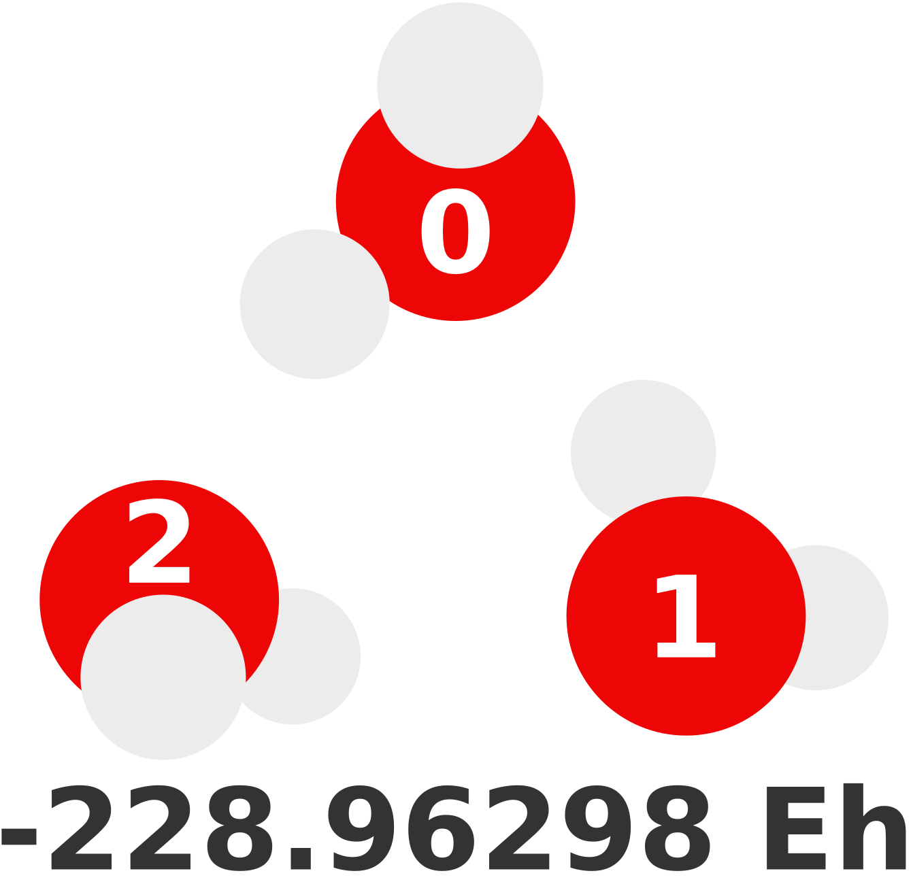
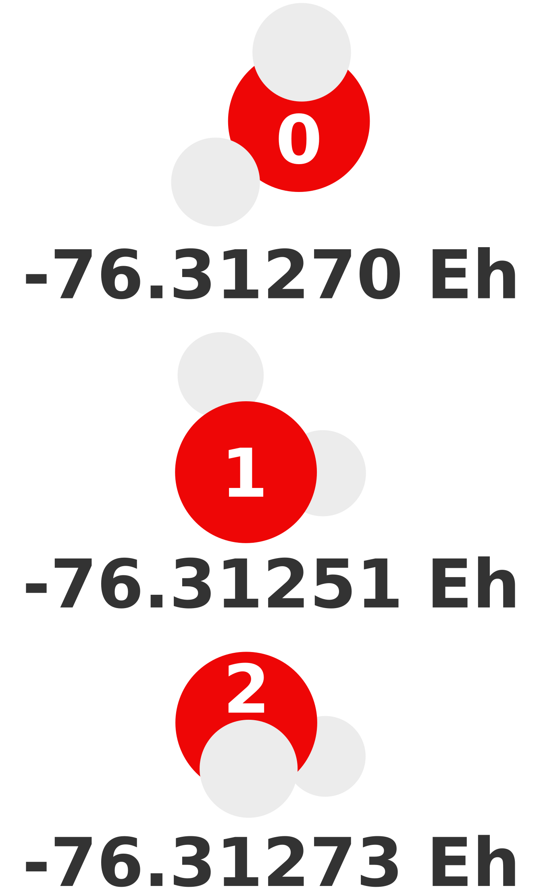
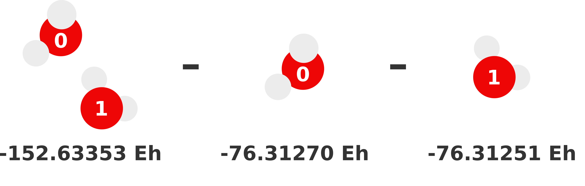
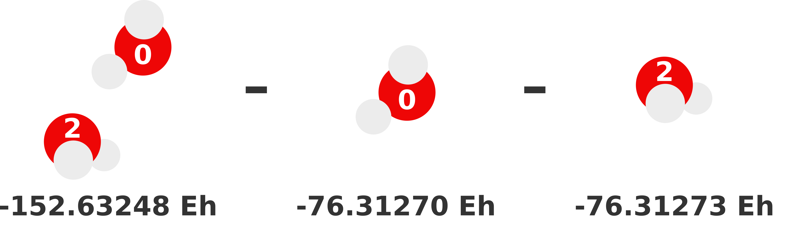
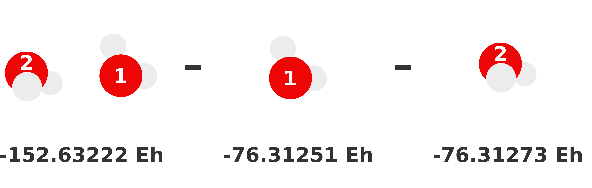
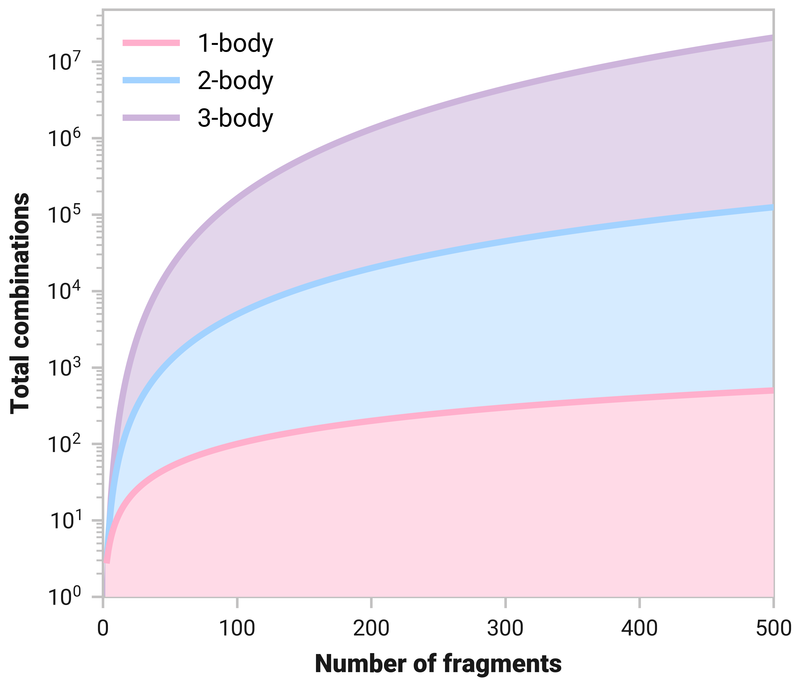
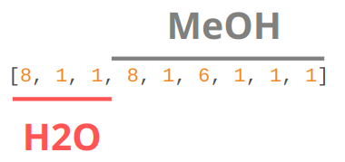
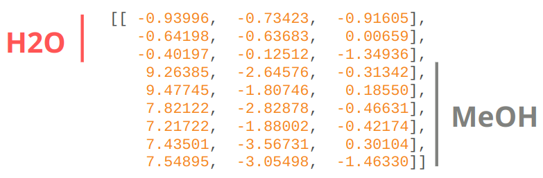
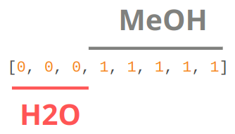
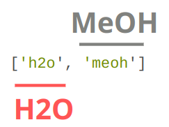

====================
Many-body expansions
====================

The many-body expansion (MBE) represents the total system energy, :math:`E`, composed of :math:`N` non-covalently connected (i.e., non-intersecting) fragments/monomers as the sum of :math:`n`-body interaction energies:

.. math::
    E = \sum_{i}^N E_i^{(1)} + \sum_{i < j}^N \Delta E_{i,j}^{(2)} + \sum_{i < j < k}^N \Delta E_{i,j,k}^{(3)} + \cdots.
    :label: mbe_sum

Here, :math:`N` is the number of monomers; :math:`i`, :math:`j`, and :math:`k` are monomer indices; :math:`E_i^{(1)}` is the energy of monomer :math:`i`; and :math:`\Delta E_{\; i, \: j, \: \ldots}^{\; (n)}` represents the :math:`n`-body interaction energy contribution of the structure containing fragments :math:`i`, :math:`j`, :math:`\ldots` with lower order (:math:`< n`) contributions removed.
For example, the 2-body contribution of :math:`i` and :math:`j` is

.. math::
    \Delta E_{i,j}^{(2)} = E_{i,j}^{(2)} - E_{i}^{(1)} - E_{j}^{(1)},
    :label: 2_body_term

and the 3-body contributions with monomers :math:`i`, :math:`j`, and :math:`k` are

.. math::
    \Delta E_{i,j,k}^{(3)} = E_{i,j,k}^{(3)} - \Delta E_{i,j}^{(2)} - \Delta E_{i,k}^{(2)} - \Delta E_{j,k}^{(2)}  - E_{i}^{(1)} - E_{j}^{(1)} - E_{k}^{(1)}.
    :label: 3_body_term

Equation :eq:`mbe_sum` is exact when all :math:`n`-body contributions up to :math:`N` are accounted for with exact accuracy and precision.
This equation also holds for properties that can be expressed as a derivative of energy (e.g., gradients).
In practice, the expansion is always truncated to some order, :math:`n`, which is usually 3.

What is a fragment?
===================

MBEs are built upon what we define our fragments/monomers to be.
A fragment is a group atoms we represent as monomer used to define :math:`n`-body interactions.
Procedures to fragment the system are classified based on two categories:

.. glossary::

    **Covalent fragments**
        Whether a fragment "breaks" covalent bonds.
        Non-covalent fragments occur when the entire molecule is its own fragment.
        Separating a molecule into individual fragments is possible, but there are additional complexities.
        We do not consider covalent fragments here.
    
    **Intersecting fragments**
        Nothing precludes defining fragments with more than one molecule.
        This changes the many-body formulation and Equation :eq:`mbe_sum` is not applicable.
        Principle of inclusion and exclusion (PIE) generally is used with intersecting fragments.
        We do not support this, yet.
        Only non-intersecting fragments are considered here.

Non-covalent, non-intersecting fragments are the default in almost all of our cases here.

The choice is yours, but the driving aspect of selecting a fragmentation scheme is often the number and size of :math:`n`-body combinations.
If we consider a water trimer, there are substantially more 2- and 3-body structures if we fragment with respect to atoms instead of molecules.
Not to mention that whole molecular fragments are typically more accurate.
Computational cost of fragments also becomes an issue if they are particularly large.

See :ref:`no free lunch <no free lunch>` for more discussion.

Water trimer example
====================

We find MBEs are much easier to understand with an example.
Suppose we want to compute the energy of the following trimer with MP2/def2-TZVP and that this level of theory is intractable.
Obviously this calculation is possible in a matter of seconds---as the energy is shown below---but just imagine we cannot.

1-body
------

The first term of the MBE (Equation :eq:`mbe_sum`) represents the 1-body contributions of this structure.
Before this we have to define what our 1-body structures or fragments are.
Each molecule will be a fragment since they are small and it is a non-covalent cluster (fragment indices are shown above).
Thus, our 1-body prediction, :math:`E^{(1)}`, of this trimer would be

.. math::
    E^{(1)} = E_0^{(1)} + E_1^{(1)} + E_2^{(1)}.

:math:`E_0^{(1)}` means the total energy of monomer 0 calculated at our desired level of theory: MP2/def2-TZVP.
Each monomer energy is shown below.

After computing :math:`E_0^{(1)}`, :math:`E_1^{(1)}`, and :math:`E_2^{(1)}` our sum becomes

.. math::
    E^{(1)} = -76.31270 \;\text{Eh} + -76.31251 \;\text{Eh} + -76.31273 \;\text{Eh} = -228.93794 \;\text{Eh}.

-228.93794 Eh is our 1-body prediction of this particular trimer.
In terms of accuracy, the error is a whopping -0.02504 Eh (-15.7 kcal/mol).
This error is unsurprising as we have made not accounted for how these water molecules are interacting.

2-body
------

Our previous 1-body prediction was subpar with a rather larger error.
We can substantially reduce this error by accounting for how monomers interacts with each other (i.e., dimer interactions).
These interaction are called the 2-body contributions to the MBE which is defined in Equation :eq:`2_body_term`.
Essentially, we need to compute the total energy of each possible dimer and subtract out the monomer (i.e., lower order) contributions.
Whatever energy is left over is the 2-body contribution of that dimer to the sum.

We visually depict these three 2-body calculations below.

.. note::

    We can reuse the monomer energies calculated in the previous section because our structure has not changed!

Our total 2-body term is just the sum of these 2-body contributions: 

.. math::
    \Delta E^{(2)} = \Delta E_{0,1}^{(2)} + \Delta E_{0,2}^{(2)} + \Delta E_{1,2}^{(2)}.

For our particular system, this ends up being 

.. math::
    \Delta E^{(2)} = -0.00831 \;\text{Eh} + -0.00705 \;\text{Eh} + -0.00700 \;\text{Eh} = -0.02236 \;\text{Eh}.

Thus, our 2-body prediction is the original 1-body plus the 2-body term,

.. math::
    E^{(2)} = -228.93794 \;\text{Eh} + -0.02236 \;\text{Eh} = -228.96033 \;\text{Eh}.

Our 2-body prediction of this trimer is -228.96033 Eh.
We have reduced our error by an order of magnitude to -0.00267 Eh (-1.7 kcal/mol)!

.. attention::

    This leftover -1.7 kcal/mol is actually the 3-body energy of this trimer.
    However, there is no way we could know these errors without being able to compare to the actual energy of the trimer.
    Practical applications of MBE involve structures we actually cannot compute.

No free lunch
=============

Up to this point we have swept a few things under the rug about how accurate and useful MBEs are.
In the past, MBE was often referred to as a "free lunch," where high-light *ab initio* results for large systems are easily attainable with minimal loss of accuracy.
Contemporary research shows this is not entirely true; there are nuances that influence MBE accuracy.
We discuss a few of the main aspects here so you can judge if this approach will work for your systems.

Curse of dimensionality
-----------------------

As previously mentioned, one of the crucial aspects of MBEs is system fragmentation.
When the number of fragments of a system grows the total number of :math:`n`-body combinations explodes.
The figure below shows the number of 1-, 2-, and 3-body structures with respect to system size.

Large systems can quickly grow computationally cumbersome.
For example, there are 161 700 total 3-body contributions for systems with 100 fragments.

Basis set errors
----------------

TODO

Specifying fragments in mbGDML
==============================

In order to make many-body predictions we have to specify the fragments to generate :math:`n`-body combinations from.
For example, we can consider making a MBE(2) prediction of a water and methanol cluster.
This is rather small system, but it is useful for understanding the concepts.

   Example structure of a water and methanol molecule.

As with most atomistic modeling practices, we must specify atomic numbers and coordinates of the structure.

   ``Z``: atomic numbers of all atoms in the system.

   ``R``: Cartesian coordinates in the same order as ``Z``.

Some ML potentials require the order of the atoms to be the exact same (e.g., GDML).
This means any indistinguishable atoms must be in the same order.
For the structure specified above, we must have the water molecule then the methanol.
Water's oxygen atom must come before the hydrogens whose order does not matter.
With methanol, we specify the OH group first, then the CH3 group where the first hydrogen is the one furthest from the OH hydrogen and proceeding in a clockwise direction.

   ``entity_ids``: integers that specify which fragment each atom belongs to.

   ``comp_ids``: labels for each ``entity_id`` used to determine relevant models.

Additional resources
====================

This is only a glimpse into the vast sea of MBE literature.
Please see the following incomplete list of literature for additional information on many-body expansions.

.. attention::

    If you have any questions or comments about the information presented here please do not hesitate to create a `discussion on the GitHub repository <https://github.com/keithgroup/mbGDML/discussions>`__.

- **Overview**: `10.1063/1.5126216 <https://doi.org/10.1063/1.5126216>`__, `10.1063/1.4986110 <https://doi.org/10.1063/1.4986110>`__, `10.1063/1.4947087 <https://doi.org/10.1063/1.4947087>`__, `10.1063/1.4885846 <https://doi.org/10.1063/1.4885846>`__
- **Cutoffs**: `10.1021/acs.jctc.9b01095 <https://doi.org/10.1021/acs.jctc.9b01095>`__
- **Molecular dynamics**: `10.1021/acs.jctc.1c00780 <https://doi.org/10.1021/acs.jctc.1c00780>`__
- **Basis sets**: `10.1021/acs.jctc.7b01232 <https://doi.org/10.1021/acs.jctc.7b01232>`__
- **Ions**: `10.1039/D1CP00409C <https://doi.org/10.1039/D1CP00409C>`__, `10.1021/acs.jctc.0c01309 <https://doi.org/10.1021/acs.jctc.0c01309>`__, `10.1021/acs.jctc.9b00749 <https://doi.org/10.1021/acs.jctc.9b00749>`__
- **Metals**: `10.1063/5.0094598 <https://doi.org/10.1063/5.0094598>`__

