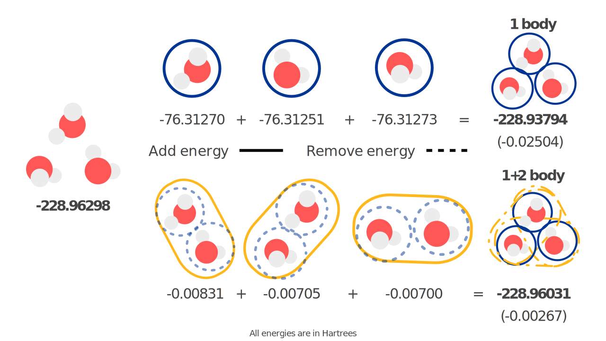

====================
Many-body expansions
====================

Specifying fragments
====================

In order to make many-body predictions we have to specify the fragments to generate :math:`n`-body combinations from.
For example, we can consider making a MBE(2) prediction of a water and methanol cluster.
Obviously this is rather small system, but it is useful for understanding the concepts.

.. figure:: images/mbe-explained/2-body-example.png
   :width: 250px
   :align: center

   Example structure of a water and methanol molecule.

As with most atomistic modeling practices, we must specify atomic numbers and coordinates of the structure.

.. figure:: images/mbe-explained/2-body-z.png
   :width: 250px
   :align: center

   ``Z``: atomic numbers of all atoms in the system.

.. figure:: images/mbe-explained/2-body-r.png
   :width: 525px
   :align: center

   ``R``: Cartesian coordinates in the same order as ``Z``.

Some ML potentials require the order of the atoms to be the exact same (e.g., GDML).
This means any indistinguishable atoms must be in the same order.
For the structure specified above, we must have the water molecule then the methanol.
Water's oxygen atom must come before the hydrogens whose order does not matter.
With methanol, we specify the OH group first, then the CH3 group where the first hydrogen is the one furthest from the OH hydrogen and proceeding in a clockwise direction.

.. figure:: images/mbe-explained/2-body-entity-ids.png
   :width: 250px
   :align: center

   ``entity_ids``: integers that specify which fragment each atom belongs to.

.. figure:: images/mbe-explained/2-body-comp-ids.png
   :width: 175px
   :align: center

   ``comp_ids``: labels for each ``entity_id`` used to determine relevant models.

