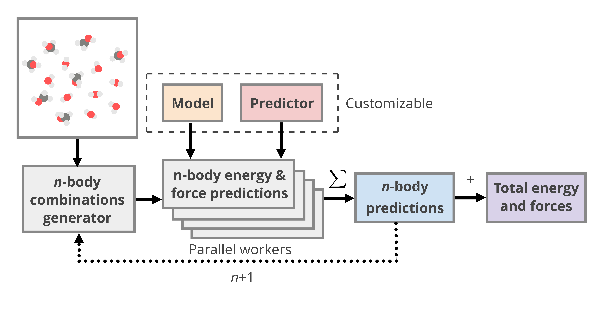

==========
Predicting
==========

mbGDML was originally designed just for GDML models; hence the name.
However, other ML potentials or even QC methods can be used to make many-body predictions.
We designed an extensible, modular framework for many-body predictions using :class:`~mbgdml.mbe.mbePredict`.

:class:`~mbgdml.mbe.mbePredict` requires :math:`n`-body models and predictor functions.

Model
=====

Information needed to make quantum chemistry or machine learning predictions are contained in objects that inherit the :class:`~mbgdml.models.Model` class.
For example, :class:`~mbgdml.models.gdmlModel` stores GDML parameters for use in its predict function.

Predict
=======

Predict functions perform the actual predictions from the respective model object along with

- ``Z``: atomic numbers,
- ``R``: cartesian coordinates of a single structure,
- ``entity_ids``: integers specifying atoms that make up individual entities or fragments,
- ``entity_combs``: unique combinations of entity IDs to predict. 

For example, :func:`~mbgdml.predictors.predict_gdml` will sum up all :math:`n`-body combinations for its contribution to ``R``'s energy and forces.
You can also have decomposed predict functions (i.e., :func:`~mbgdml.predictors.predict_gdml_decomp`) that returns all individual :math:`n`-body energies and forces.

``mbePredict``
==============

:class:`~mbgdml.mbe.mbePredict` handles all aspects of making many-body expansion predictions with ML potentials.
Once initialized, predictions are made with the :meth:`~mbgdml.mbe.mbePredict.predict` method where we :ref:`specify our system <specifying-fragments>`.
:meth:`~mbgdml.mbe.mbePredict.compute_nbody` is then called for each loaded model until all possible :math:`n`-body contributions are accounted for.

.. warning::
    Predictions are made by iterating through models and accounting for all compatible entities.
    If the model component IDs are different, no entity combinations are used.

Parallel predictions
--------------------

Many-body expansions are known for their curse of dimensionality: as the supersystem grows in size so does the number of entity combinations.
These can be easily parallelized by assigning workers with specified batch sizes.
At the moment, only a `ray <https://docs.ray.io/en/latest/>`_ implementation for GDML is provided by specifying ``use_ray`` to ``True`` and setting ``n_workers``.

Supported potentials
--------------------

mbGDML already provides support for the following potentials: 

- Gradient-Domain Machine Learning (GDML) with :class:`~mbgdml.models.gdmlModel` and :func:`~mbgdml.predictors.predict_gdml`
- Gaussian Approximation Potential (GAP) with :class:`~mbgdml.models.gapModel` and :func:`~mbgdml.predictors.predict_gap`
- SchNetPack with :class:`~mbgdml.models.schnetModel` and :func:`~mbgdml.predictors.predict_schnet`

Examples
========

.. code-block:: python
    :caption: Prediction of (H2O)6 using mbGDML
    
    import numpy as np
    from mbgdml.mbe import mbePredict
    from mbgdml.models import gdmlModel
    from mbgdml.predictors import predict_gdml
    from mbgdml.descriptors import Criteria, com_distance_sum
    from mbgdml.utils import get_entity_ids

    # Loading mbGDML models.
    model_paths = [
        './1h2o-model-train1000.npz',
        './2h2o-model-nbody-train1000.npz',
        './3h2o-model-nbody-train1000.npz'
    ]
    model_comp_ids = [['h2o'], ['h2o', 'h2o'], ['h2o', 'h2o', 'h2o']]
    model_desc_kwargs = (
        {'entity_ids': get_entity_ids(atoms_per_mol=3, num_mol=1)},
        {'entity_ids': get_entity_ids(atoms_per_mol=3, num_mol=2)},
        {'entity_ids': get_entity_ids(atoms_per_mol=3, num_mol=3)},
    )
    model_desc_cutoffs = (None, 6.0, 10.0)
    model_criteria = [
        Criteria(com_distance_sum, desc_kwargs, cutoff) for desc_kwargs, cutoff \
        in zip(model_desc_kwargs, model_desc_cutoffs)
    ]
    models = [
        gdmlModel(path, comp_ids=model_comp_id, criteria=criteria) \
        for path, model_comp_id, criteria \
        in zip(model_paths, model_comp_ids, model_criteria)
    ]
    mbe_pred = mbePredict(models, predict_gdml)

    # Structure information. This often comes from structure or data sets.
    Z = np.array([8, 1, 1, 8, 1, 1, 8, 1, 1, 8, 1, 1, 8, 1, 1, 8, 1, 1])
    R = np.array(
        [[[-1.73521802, -1.13083385,  0.32487853],
          [-1.54501802, -1.25583385, -0.62092147],
          [-1.84191802, -0.15413385,  0.35947853],
          [-1.43631802,  1.61886615, -0.08302147],
          [-1.17431802,  1.32596615, -0.97352147],
          [-0.58621802,  1.75866615,  0.37227853],
          [-0.54571802, -0.22923385, -2.18532147],
          [-0.48351802, -0.31643385, -3.14412147],
          [ 0.38158198, -0.29733385, -1.85512147],
          [ 1.87418198, -0.38073385, -0.90452147],
          [ 1.98418198,  0.47796615, -0.46422147],
          [ 1.65288198, -0.95933385, -0.15152147],
          [ 0.63868198, -1.29043385,  1.52137853],
          [-0.28361802, -1.33203385,  1.14077853],
          [ 0.67688198, -1.97713385,  2.19787853],
          [ 1.12828198,  1.42786615,  1.29217853],
          [ 1.43688198,  1.95886615,  2.03657853],
          [ 0.99038198,  0.52476615,  1.64897853]]]
    )
    entity_ids = np.array([0, 0, 0, 1, 1, 1, 2, 2, 2, 3, 3, 3, 4, 4, 4, 5, 5, 5])
    comp_ids = np.array(['h2o', 'h2o', 'h2o', 'h2o', 'h2o', 'h2o'])

    # Predict total energies and forces.
    E, F = mbe_pred.predict(Z, R, entity_ids, comp_ids)

    print(E)  # kcal/mol; shape: (1,)
    # [-287373.68561825]
    print(F)  # kcal/(mol A); shape: (1, 18, 3)
    """
    [[[ 1.88852751,  4.27617405, -3.10879603],
      [-1.1754238,  -0.56810535,  2.3096842 ],
      [-0.88610451, -3.70003292,  0.68926709],
      [ 4.77715706, -2.22894343, -2.95228678],
      [-1.8784668,   1.9091819,   2.28471297],
      [-2.2173002,   0.49008601, -0.02705656],
      [ 4.90857346, -0.01682426, -1.80407224],
      [-1.7842295,   0.53044132,  3.16420672],
      [-3.08358393, -0.33648383, -0.37426009],
      [-1.15415319,  1.8945924,   3.83795906],
      [ 0.55584665, -2.03159006, -1.76731357],
      [ 0.9244226,   0.22981244, -1.81504247],
      [-4.80053866, -2.40925025,  0.9304219 ],
      [ 3.6064161,   0.55564296,  0.93643006],
      [ 1.13709823,  2.48598204, -2.15937521],
      [ 0.72570156, -3.22025435,  3.45893275],
      [-1.07780526, -0.27544762, -2.60668182],
      [-0.46613732,  2.41501895, -0.99672996]]]
    """
