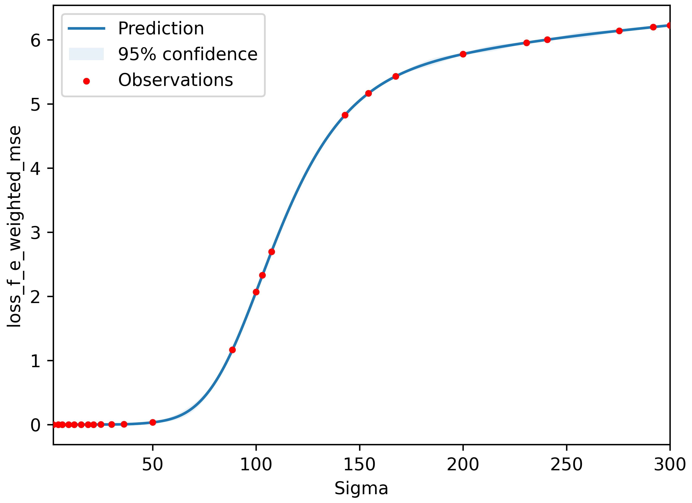
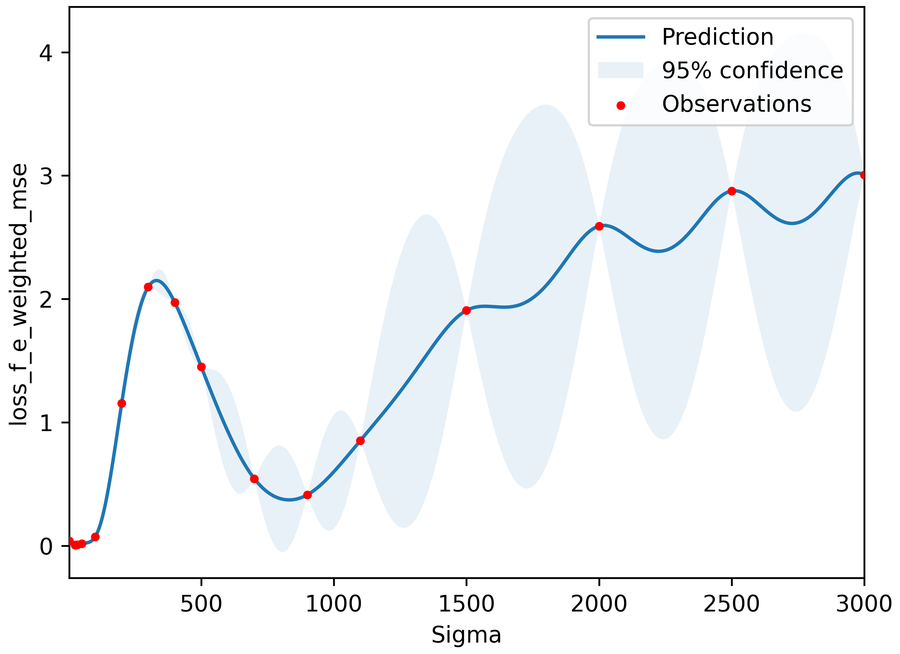
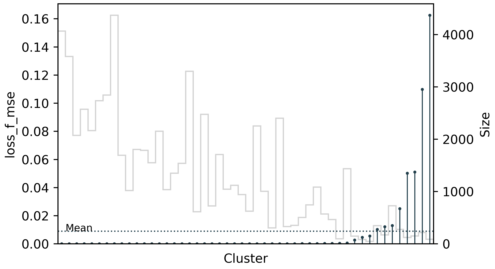
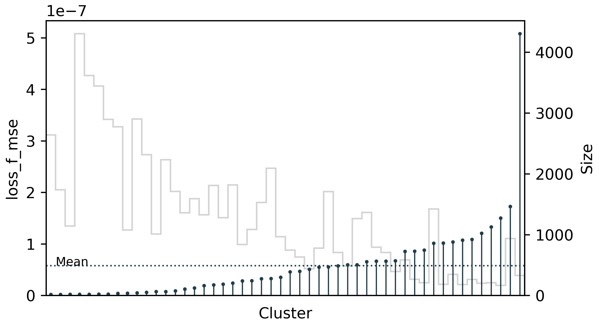

========
Training
========

mbGDML is a data-driven method, meaning we need to train an ML model to reproduce a system's potential energy surface (PES).
Once we have a collection of structures (usually from an MD simulation) and calculated energies and forces, we can begin training GDML models.

.. seealso::

    Code for training primarily comes from the `sGDML package <https://github.com/stefanch/sGDML>`__ where modifications were made to support many-body data and new routines.
    For more technical information, please refer to the extensive `sGDML literature <http://www.sgdml.org/>`__.

.. _training-data:

Data
====

We require data to be stored in NumPy ``npz`` files.
These are `binary files <https://numpy.org/doc/stable/reference/generated/numpy.savez.html>`__ that can store several NumPy arrays of various types.
At a minimum, mbGDML needs four arrays containing information about the PES.

- ``Z`` of shape ``(n_atoms,)``: atomic numbers for all structures in the data set.
- ``R`` of shape ``(n_structures, n_atoms, 3)``: Cartesian coordinates of all structures in the data set.
- ``E`` of shape ``(n_structures,)``: Total or many-body energy for each structure.
- ``F`` of shape ``(n_structures, n_atoms, 3)``: Total or many-body atomic forces for each structure.

.. attention::

    GDML uses a global descriptor, meaning the number and order of atoms must be the same for each structure.
    For example, if you have a single water molecule and your ``Z`` is ``[8, 1, 1]``, then every structure in ``R`` must have the oxygen atom first.

Here are some examples of water :download:`1-body <./files/dsets/1h2o.npz>`, :download:`2-body <./files/dsets/2h2o-nbody.npz>`, and :download:`3-body <./files/dsets/3h2o-nbody.npz>` data sets.

.. tip::

    Sampling, curating, and calculating data sets is done with a complementary Python package `reptar <https://github.com/aalexmmaldonado/reptar>`__.
    Please refer to `reptar's documentation <https://www.aalexmmaldonado.com/reptar/main/index.html>`__.

Data set class
--------------

We use the :class:`~mbgdml.data.DataSet` class to load and provide simple access to data.

.. note::

    We will frequently use ``Z``, ``R``, ``E``, and ``F`` as the key in the ``npz`` file for their respect data.
    You can load data sets by passing ``X_key`` when initializing the :class:`~mbgdml.data.DataSet` class.
    For example, you can have ``Z_key`` be ``'atomic_numbers'``.

What are we training?
=====================

The underlying technical details of GDML are essential, but only a few concepts are necessary for training and using models.
Briefly, a GDML model takes Cartesian coordinates and outputs energy and forces shown in the following flowchart.

.. mermaid::

    flowchart LR
        coords[/Coordinates/] --> desc[/Descriptor/]
        desc -- sigma --> traindist[/Train set distances/]
        traindist -- alphas --> forces[/Forces/]
        forces -- integ_c --> energy[/Energy/]

``sigma``, ``alphas``, and the integration constant ``integ_c`` are the three data pieces we get during training for predictions.
We will discuss these later.

Matérn kernel
-------------

GDML is based on the Matérn kernel, :math:`k_\nu`, that is twice differentiable (:math:`\nu = 5/2`):

.. math::
    k_{5/2} (\overrightarrow{x}_i, \overrightarrow{x}_j) = \left( 1 + \frac{\sqrt{5}}{\sigma} d(\overrightarrow{x}_i, \overrightarrow{x}_j) 
    + \frac{5}{3\sigma} d(\overrightarrow{x}_i, \overrightarrow{x}_j)^2 \right) \exp \left( - \frac{\sqrt{5}}{\sigma} d (\overrightarrow{x}_i, \overrightarrow{x}_j) \right),
    :label: matern_kernel

where :math:`\overrightarrow{x}_i` and :math:`\overrightarrow{x}_j` are the descriptors of two data points :math:`i` and :math:`j`, :math:`\sigma` is the kernel length scale, and :math:`d (\overrightarrow{x}_i, \overrightarrow{x}_j)` is the L2 (i.e., Euclidean) norm or distance between :math:`\overrightarrow{x}_i` and :math:`\overrightarrow{x}_j`.

.. note::

    GDML literature uses :math:`\sigma` to represent kernel length scale.
    :math:`l` is often used in other sources.

GDML uses the inverse atomic pairwise distances as the descriptor (e.g., :math:`x_i` and :math:`x_j`).
For example, consider this water dimer.

.. raw:: html

    
    <!-- Any 3Dmol version higher than this breaks. Kicking the can. -->

    

    

We can compute the inverse atomic pairwise distances with :func:`~mbgdml._gdml.desc._from_r` (and their partial derivatives needed for GDML models).

.. code-block:: python

    import numpy as np
    from mbgdml._gdml.desc import _from_r

    # Water dimer coordinates.
    R = np.array(
        [[ 1.80957202,  0.78622087,  0.4170556 ],
         [ 1.39159092,  0.9217478 ,  1.27126597],
         [ 2.40137633,  0.04199757,  0.55361951],
         [-0.16942685,  0.19603795, -1.64383542],
         [-0.10053189,  0.84679289, -2.34463743],
         [ 0.50972947,  0.45598791, -1.00676722]]
    )
    # Compute the pairwise descriptors and their partial derivatives.
    r_desc, r_desc_d = _from_r(R)
    print(r_desc)  # Descriptor
    # [1.04101674 1.04101716 0.65814497 0.34275482 0.29538202 0.29537792
    #  0.29775736 0.25559815 0.25559542 1.04293945 0.51124879 0.40212734
    #  0.40211189 1.03435064 0.65723451]
    print(r_desc_d)  # Descriptor partial derivatives
    # [[-0.47155221  0.15289692  0.96369139]
    #  [ 0.66765451 -0.83960869  0.15406699]
    #  [ 0.28786826 -0.25079801 -0.20458568]
    #  [-0.07968861 -0.02376498 -0.08298618]
    #  [-0.04023092 -0.01870317 -0.07512869]
    #  [-0.0662526   0.0039698  -0.05663098]
    #  [-0.05042484  0.00159904 -0.07290594]
    #  [-0.02491596 -0.00125162 -0.06037956]
    #  [-0.04177636  0.01343831 -0.04839451]
    #  [ 0.07815643  0.73823522 -0.79501006]
    #  [-0.17369512 -0.04412831 -0.19026234]
    #  [-0.05734442 -0.03028677 -0.14813267]
    #  [-0.12299311  0.02691727 -0.10145489]
    #  [ 0.75157635  0.28766903  0.70500027]
    #  [ 0.17325148 -0.11094843  0.37981758]]

.. note::

    Predictions using GDML do not directly use :func:`~mbgdml._gdml.desc._from_r` but instead uses :class:`~mbgdml._gdml.desc.Desc`.

.. important::

    GDML does not directly use or compute the Matérn kernel.
    Instead, it uses the Hessian matrix of the Matérn kernel where each row and column encodes how a training point "interacts" with all other training points.
    We will refer to this as the **kernel matrix**.
    :meth:`~mbgdml._gdml.train.GDMLTrain._assemble_kernel_mat` and :func:`~mbgdml._gdml.train._assemble_kernel_mat_wkr` are used to build this.

``sigma``
---------

The kernel length scale, :math:`\sigma` or ``sigma``, is the hyperparameter we optimize during training from Equation :eq:`matern_kernel`.
It broadly represents the smoothness of how quickly the kernel function can change.
As we can see in the figures below, the smaller length scale rapidly changes to better fit the data.

.. figure:: http://evelinag.com/Ariadne/img/smallLengthscale.png
   :align: center
   :width: 350 px

   Small length scale.

.. figure:: http://evelinag.com/Ariadne/img/largeLengthscale.png
   :align: center
   :width: 350 px

   Large length scale.

There is no analytical way to determine the optimal ``sigma``.
We have to iteratively try values that minimizes the error during training.
How we do this in mbGDML will be discussed later.

``alphas``
----------

Once we have the kernel Hessian, we need the ``(n_train, n_atoms, 3)`` regression parameters.
This is analytically determined using Cholesky factorization.
First, we use :func:`scipy.linalg.cho_factor` to decompose the negative kernel matrix from :meth:`~mbgdml._gdml.train.GDMLTrain._assemble_kernel_mat` after we apply the regularization parameter ``lam``: ``K[np.diag_indices_from(K)] -= lam``.
The negative of :func:`scipy.linalg.cho_solve` computes ``alphas`` where the targets are the atomic forces (scaled by their standard deviation).
If Cholesky factorization fails, we try LU factorization with :func:`scipy.linalg.solve`.

.. math::
    \hat{\boldsymbol{f}}_\boldsymbol{F} (\overrightarrow{x}_i) = \sum_i^M \sum_j^{3N} \left( \overrightarrow{\alpha}_i \right)_j
    \frac{\partial}{\partial x_j} \nabla_{\overrightarrow{x}_i} \: k_{5/2} (\overrightarrow{x}_i, \overrightarrow{x}_j)
    :label: gdml_force_eq

All of this is automatically done in :class:`~mbgdml._gdml.solvers.analytic.Analytic`.

``integ_c``
-----------

GDML is an energy-conserving force field where the energy is recovered by integrating the forces up to an integration constant, ``integ_c``.

.. math::
    \hat{f}_E (\overrightarrow{x}_i) = \sum_i^M \sum_j^{3N} \left( \overrightarrow{\alpha}_i \right)_j
    \frac{\partial}{\partial x_j} k_{5/2} (\overrightarrow{x}_i, \overrightarrow{x}_j) + c
    :label: gdml_energy_eq

This is automatically done in :meth:`~mbgdml._gdml.train.GDMLTrain._recov_int_const`.

Training routines
=================

We provide a class, :class:`~mbgdml.train.mbGDMLTrain`, that manages all training routines.
All you need to do is initialize :class:`~mbgdml.train.mbGDMLTrain` with the desired options and then pick one of the following routines to train a model:

- :meth:`~mbgdml.train.mbGDMLTrain.grid_search`,
- :meth:`~mbgdml.train.mbGDMLTrain.bayes_opt`.

The primary difference between these two routines is how an optimal ``sigma`` is selected.
:meth:`~mbgdml.train.mbGDMLTrain.grid_search` is a brute-force routine where it selects the model with the lowest validation loss from each ``sigma`` in :attr:`~mbgdml.train.mbGDMLTrain.sigma_grid`.
:meth:`~mbgdml.train.mbGDMLTrain.bayes_opt` takes this a step further and uses Bayesian optimization of ``sigma`` around the region identified by a preliminary grid search.

``create_task``
---------------

:meth:`~mbgdml.train.mbGDMLTrain.create_task`

.. mermaid::

    flowchart LR
        mbGDMLTrain([mbGDMLTrain]) -- sigma --> create_task([create_task])
        create_task --> task[/Task/]

``train_model``
---------------

:meth:`~mbgdml.train.mbGDMLTrain.train_model`

.. mermaid::

    flowchart LR
        task[/Task/] --> train_model([train_model])
        train_model --> model[/Model/]

``add_valid_errors``
--------------------

.. mermaid::

    flowchart LR
        model[/Model/] --> add_valid_errors([add_valid_errors])
        add_valid_errors --> errors[/Validation errors/]

``sigma`` optimization
======================

mbGDML provides two standard routines for optimizing ``sigma``: :meth:`~mbgdml.train.mbGDMLTrain.grid_search` and :meth:`~mbgdml.train.mbGDMLTrain.bayes_opt`

``grid_search``
---------------

:meth:`~mbgdml.train.mbGDMLTrain.grid_search` performs a simple grid search on the ``sigmas`` provided in :attr:`~mbgdml.train.mbGDMLTrain.sigma_grid`.
Typically, the validation errors will decrease with increasing ``sigmas`` and eventually start rising.
So we sort the sigmas by ascending values and repeat the training routine discussed above until the validation errors begin to rise.

    Validation loss, :func:`~mbgdml.losses.loss_f_e_weighted_mse`, of training a water 1-body force field with 1000 training points.
    Note: additional ``sigmas`` were performed for illustrative purposes.

.. admonition:: Info

    This is how the `sGDML package <https://github.com/stefanch/sGDML>`__ trains their models.

``bayes_opt``
-------------

More often than not, the optimal ``sigma`` is not one in :attr:`~mbgdml.train.mbGDMLTrain.sigma_grid`, but somewhere in between.
We implemented a routine using the `bayesian-optimization <https://github.com/fmfn/BayesianOptimization>`__, package that better optimizes ``sigmas``.
Furthermore, unlike the `sGDML package <https://github.com/stefanch/sGDML>`__ we do not restrict ``sigma`` to integer values.

    Validation loss, :func:`~mbgdml.losses.loss_f_e_weighted_mse`, of training a water 2-body force field with 300 training points.

Active learning
===============

:meth:`~mbgdml.train.mbGDMLTrain.active_train`

    Mean loss, :func:`~mbgdml.losses.loss_f_mse`, from a randomly trained water 1-body model on 1000 structures.
    An initial model was trained on ``100`` structures and ``50`` structures were iteratively added until ``1000`` was reached.
    The maximum cluster loss was :math:`0.163` [kcal/(mol A)]\ :sup:`2`.

    Mean loss, :func:`~mbgdml.losses.loss_f_mse`, from a water 1-body model trained with active learning on 1000 structures.
    Structures were automatically selected using :func:`~mbgdml._gdml.sample.draw_strat_sample`.
    The maximum cluster loss was :math:`5.079 \times 10^{-7}` [kcal/(mol A)]\ :sup:`2`.

.. seealso::

    This active learning procedure was presented in DOI: `10.1063/5.0035530 <https://doi.org/10.1063/5.0035530>`__.

Examples
========

Water 3-body
------------

These examples demonstrate different procedures to train a 3-body water model using the :class:`~mbgdml.train.mbGDMLTrain` interface.
All examples below can be used with :download:`this dataset <./files/dsets/3h2o-nbody.npz>`.

Active learning
^^^^^^^^^^^^^^^

The script below shows an example of using :meth:`~mbgdml.train.mbGDMLTrain.active_train` for a 3-body water model.
Here is an example :download:`dataset <./files/dsets/3h2o-nbody.npz>` and :download:`model <./files/models/2023-digital-discovery/3h2o-model-gdml-nbody.npz>`.

.. code-block:: python

    import os
    from mbgdml.data import DataSet
    from mbgdml.train import mbGDMLTrain
    from mbgdml.losses import loss_f_e_weighted_mse
    from mbgdml.utils import get_entity_ids, get_comp_ids

    # Ensures we execute from script directory (for relative paths).
    os.chdir(os.path.dirname(os.path.realpath(__file__)))

    # Setting paths.
    # dset_path: Path to dataset to train on.
    # log_path: Path to directory where training will occur
    #     (logs and model will be stored here).
    model_name = "3h2o-nbody-model"
    dset_path = "3h2o-nbody.npz"
    save_dir = "./"

    # System fragmentation
    entity_ids = get_entity_ids(atoms_per_mol=3, num_mol=3)
    comp_ids = get_comp_ids("h2o", num_mol=3)

    # Loading data set
    dset = DataSet(dset_path)
    dset.entity_ids = entity_ids
    dset.comp_ids = comp_ids

    # Setting up training object
    train = mbGDMLTrain(entity_ids=entity_ids, comp_ids=comp_ids, use_sym=True, use_E=True)

    train.bayes_opt_params = {
        "init_points": 10,
        "n_iter": 10,
        "acq": "ucb",
        "alpha": 1e-7,
        "kappa": 0.1,
    }
    train.bayes_opt_params_final = {
        "init_points": 10,
        "n_iter": 20,
        "acq": "ucb",
        "alpha": 1e-7,
        "kappa": 0.1,
    }
    train.initial_grid = [
        2, 25, 50, 100, 200, 300, 400, 500, 700, 900, 1100, 1500, 2000, 2500, 3000,
        4000, 5000, 6000, 7000, 8000, 9000, 10000
    ]
    train.sigma_bounds = (min(train.initial_grid), max(train.initial_grid))
    train.loss_func = loss_f_e_weighted_mse
    train.loss_kwargs = {"rho": 0.01, "n_atoms": dset.n_Z}
    train.require_E_eval = True
    train.keep_tasks = False

    # Train the model
    train.active_train(
        dset, model_name, n_train_init=200, n_train_final=1000, n_valid=100,
        n_train_step=50, n_test=1000, save_dir=save_dir, overwrite=True,
        write_json=True, write_idxs=True,
    )

