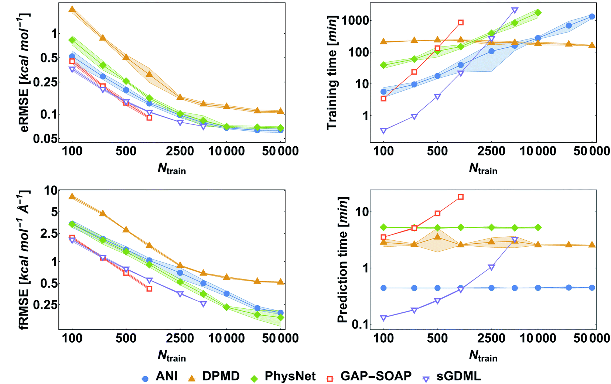

========
Training
========

The goal of training ML models is to optimize regression coefficients (i.e., parameters) to reduce some performance metric.
Once we have a :ref:`data set<data-sets>` with structures, forces, and possibly energies, we can begin training a GDML model.
This is done through the :class:`mbgdml.train.mbGDMLTrain` class.

.. autoclass:: mbgdml.train.mbGDMLTrain
    :noindex:

After initializing a ``mbGDMLTrain`` object, you then load the desired data set using the following function.
This class provides several training routines.

Hyperparameter optimization
===========================

Identifying the optimal hyperparameters for ML models is crucial.
For GDML models, the hyperparameter of interest is the kernel length scale or `sigma`.
There are several possible procedures for tuning hyperparameters and mbGDML provides two options.

Bayesian optimization
---------------------

.. automethod:: mbgdml.train.mbGDMLTrain.bayes_opt
    :noindex: 

Grid search
-----------

.. automethod:: mbgdml.train.mbGDMLTrain.grid_search
    :noindex: 

Iterative training
==================

Curating the training set is no easy task.
Instead of sampling based on energy distributions, we can iteratively build the training set to improve global accuracy.
This involves two stages:

1. Training a preliminary model with the standard sampling procedure.
For example, a model trained on 200 data points.

2. Using the previous model, make predictions of the entire dataset and identify structures with high errors.
Add these structures to the previous training set and repeat until the final training set size is reached.

In the end, we have a model that has minimized the maximum errors across the data set.
However, this comes at the expense of raising the smallest errors.

.. automethod:: mbgdml.train.mbGDMLTrain.iterative_train
    :noindex: 

Data set splitting
==================

The data set is split up into three portions: training, validation, and test (as seen in the figure below).

.. figure:: https://pubs.acs.org/na101/home/literatum/publisher/achs/journals/content/chreay/2021/chreay.2021.121.issue-16/acs.chemrev.0c01111/20210818/images/large/cr0c01111_0009.jpeg

    Unke, O. T.; et al. *Chem. Rev.* **2021** *21* (16), 10142--10186. DOI: 10.1021/acs.chemrev.0c01111

Validation sets are used to select optimal model hyperparameters.
After training a new preliminary model it is used to predict forces (and energies if requested) of the validation set.
Prediction errors are then compared to models trained on other hyperparameters.
The best performing model is selected and analyzed against the test set---a collection of data points never seen by the model---to provide an estimate of the generalization error.
``mbGMDL`` automatically takes care of all these aspects by using :meth:`~mbgdml.train.mbGDMLTrain.train` 

Tips
====

Training set size
-----------------

GDML is a kernel-based method which means the size of the training set influences both training and prediction time.
For example, the figure below shows how the number of training structures impact various aspects of a (ethanol) ML potential model.
Both kernel methods (sGDML and GAP-SOAP) typically outperform neural network potentials (ANI, DPMD, and PhysNet) but quickly become slower with more structures.
It is common to only train mbGDML models on 1,000 structures, but including more data is certainly possible.

    Pinheiro, M.; et al. *Chem. Sci.* **2021** *12* (43), 14396--14413. DOI: 10.1039/D1SC03564A

Hyperparameters
---------------

Identifying the optimal hyperparameter is often troublesome.
A general rule of thumb is to find the smallest hyperparameter that minimizes validation errors.
This helps avoid overfitting, and why ``mbGDML`` evaluates hyperparameters from smallest to largest.
Training is then terminated once validation errors start to rise (even if training errors are decreasing).

.. figure:: https://pubs.acs.org/na101/home/literatum/publisher/achs/journals/content/chreay/2021/chreay.2021.121.issue-16/acs.chemrev.0c01111/20210818/images/large/cr0c01111_0017.jpeg

    Unke, O. T.; et al. *Chem. Rev.* **2021** *21* (16), 10142--10186. DOI: 10.1021/acs.chemrev.0c01111

Optimal hyperparameters for mbGDML models can range from 2 to 500---or even higher.
Running a large grid search (i.e., wide range and step size) can help hone in on guesses for more fine searches.

.. important::
    Random training structures are selected if none are specified.
    Be sure to specify training indices if running multiple iterations (e.g., hyperparameter searches).

