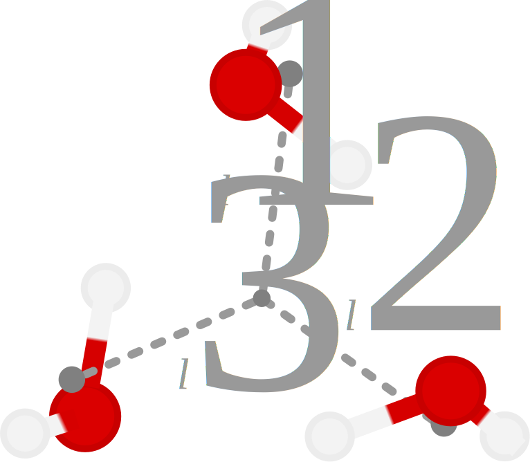

.. _tut-water-pot:

=========================
Tutorial: Water potential
=========================

We walk through a general framework for developing a mbGDML potential for a single species: water.
At the end, we will have models that predict 1-, 2-, and 3-body interactions at the MP2/def2-TZVP level of theory.

.. note::
    Nothing precludes using a higher, or lower, level of theory.
    Many-body GDML only reproduces the provided energy and forces labels of the data set.
    Recomputing the energies and forces of the data sets is all that is needed to change the level of theory.

Configurational sampling
========================

First, we have to sample across configurational space for *n*-body structures (up to three).
Molecular simulations is a common way to sample structures.
Driving molecular dynamics (MD) simulations with quantum chemistry ensures the most accurate sampling at a high computational cost.
Classical force fields dramatically accelerate these simulations, but parameters are not always available for species of interest.
Semiempirical quantum mechanics (SQM) methods offer a compromise of speed and generalizability to most chemical species of interest.
For this tutorial, we will use the `GFN2-xTB <https://doi.org/10.1021/acs.jctc.8b01176>`_ method to drive a MD simulation of a water droplet using the `xtb program <https://xtb-docs.readthedocs.io/en/latest/contents.html>`_.
We will use a higher temperature, say 500 K, to help sample low- and high-energy configurations.

`Packmol <http://leandro.iqm.unicamp.br/m3g/packmol/home.shtml>`_ is used to generate an initial structure for the simulation.
Since the `xtb program <https://xtb-docs.readthedocs.io/en/latest/contents.html>`_ only has spherical confining potentials, we will generate a spherical droplet of water.
The Cartesian coordinates of a water monomer is needed for `Packmol <http://leandro.iqm.unicamp.br/m3g/packmol/home.shtml>`_.
Here is the `MP2/def2-TZVP optimized geometry of a water molecule <https://github.com/keithgroup/solute-solvent-clusters/tree/main/clusters/homogeneous/h2o/1h2o/1h2o.abc>`_ that we use called ``1h2o.abc.mp2.def2tzvp.xyz``.

.. code-block:: text
    
    3

    O      0.000000    0.000000    0.216072
    H      0.000000    0.761480   -0.372151
    H      0.000000   -0.761480   -0.372151

.. warning::

    GDML models use global descriptors (specifically inverse internuclear distances).
    This means the order of the atoms matters, and every structure we want to predict has to provide the Cartesian coordinates in this order: the Oxygen atom, then the hydrogens.
    Because of symmetry we can specify the hydrogen atoms in any order.

    In a molecule such as methanol the methyl hydrogens are distinguishable---with respect to the hydroxyl group---and their order matters with respect to the hydroxyl group and rotation (i.e., clockwise or counterclockwise).
    However, just the rotational order of the hydrogens on acetonitrile would matter.

    Thus, setting the order of the atoms here, in the monomer structure, is highly recommended.

Now we can use `packmol <http://leandro.iqm.unicamp.br/m3g/packmol/home.shtml>`_ to generate a sphere with a diameter of, say, 20 Angstroms.
This size would ensure we can sample enough long-distance structures.
Using properties of the molecule (i.e., mass density and molar mass) we can compute the number of molecules to include for a 500 K droplet of water---this ends up being around 140 water molecules.
A `packmol <http://leandro.iqm.unicamp.br/m3g/packmol/home.shtml>`_ input file to generate this structure is shown below.
The resulting structure will look something like :download:`this xyz file<../files/tut-water/140h2o.pm.xyz>`.

.. code-block:: text

    tolerance 2.0
    output 140h2o.sphere-packmol.xyz
    filetype xyz
    structure 1h2o.abc.mp2.def2tzvp.xyz
        number 140
        inside sphere 0.0 0.0 0.0 10.0
    end structure

Now we are ready to prepare a GFN2-xTB simulation.
Minimizing the `packmol <http://leandro.iqm.unicamp.br/m3g/packmol/home.shtml>`_ structure ensures we have a reasonable starting structure.
Since we are using GFN2-xTB for the MD simulation, we first need to optimize it using the same level of theory.
We can do this with the `xtb program <https://xtb-docs.readthedocs.io/en/latest/contents.html>`_ using the following command.
We will get something like :download:`the following structure<../files/tut-water/140h2o.pm.gfn2.xyz>`.

.. code-block:: bash

    xtb ./140h2o.pm.xyz --opt tight --gfn 2 --charge 0 --cycles 200

Now we are ready to run a GFN2-xTB simulation using the input file below named ``140h2o.pm.gfn2-xtb.md.eq1-gfn2.500k.wallpot.inp``.
Basically, this runs a 10 picosecond NVT simulation at 500 K with a 1 femtosecond integration time step to equilibrate the system.
A spherical confining potential is used to prevent dissociation during the run.

.. code-block:: text

    $md
        restart  = false
        time     =  10.0  # in ps (1000 fs = 1 ps; 1 fs = 0.001 ps)
        step     =   1.0  # in fs
        dump     =  50.0  # in fs
        temp     = 500.0  # in K
        nvt      = true
        velo     = false
        hmass    =   1
        shake    =   0
        sccacc   =   1.0
    $end

    $wall
        potential = logfermi
        sphere: auto, all
        temp = 300.0
        beta = 6
    $end

    $write
        wiberg=false
        dipole=false
        charges=false
        mulliken=false
        orbital energies=false
        inertia=false
        distances=false
        final struct=false
        geosum=false
    $end

With the optimized xyz structure, we start the simulation using the following command.

.. code-block:: bash

    xtb ./140h2o.pm.gfn2.xyz --md --input 140h2o.pm.gfn2-xtb.md.eq1-gfn2.500k.wallpot.inp --gfn 2 --charge 0 --verbose

After confirming the system is fully equilibrated we will run a production simulation.
We mostly reuse the previous output file and command with two changes.

- **Time of the simulation.**
  Instead we can run a simulation for 1 picosecond.
- **Manually specify the confining potential size.**
  Before, we had a line in the ``$wall`` block that states ``sphere: auto, all`` which automatically determines the radius of the sphere and applies it to all atoms.
  The size of the confining potential could change when restarting the simulation.
  Thus, manually specifying the radius, in Bohr, is recommended.
  The output file of the previous simulation will have a line that says something like ``spherical wallpotential with radius   11.5624559 Å``.
  We just have to convert this to Bohr, which is about ``21.84987498332`` and specify it like so: ``sphere: 21.84987498332, all``.
  
  .. note::
      One could also have specified a radius corresponding to the initial `packmol <http://leandro.iqm.unicamp.br/m3g/packmol/home.shtml>`_ shape instead of letting `xtb <https://xtb-docs.readthedocs.io/en/latest/contents.html>`_ automatically determine it.
      The density of system usually significantly changes when the ``auto`` option is used.

With the :download:`production simulation trajectory<../files/tut-water/140h2o.pm.gfn2.md.500k.eq0-xtb.md.prod1-gfn2.500k.wallpot.xyz>` in hand we can being preparing a structure set.

Creating structure sets
=======================

Sometimes data sets contain information from a variety of sources and we, as practitioners of reproducible research, need to keep a breadcrumb trail of our data.
:ref:`Structure sets<structure-sets>` allow us to create a collection of structures derived from the same source (e.g., a MD simulation, global optimization, or article) along with a unique :attr:`~mbgdml.data.structureset.structureSet.md5` identifier.
Fragment/molecule specification is also defined in this stage that lets mbGDML correctly identify which model to use for each fragment.
All we need to start is a single XYZ file (our GFN2-xTB trajectory will serve this purpose).

Besides the XYZ file, only three other pieces of information are required: :attr:`~mbgdml.data.basedata.mbGDMLData.r_unit`, :attr:`~mbgdml.data.structureset.structureSet.entity_ids`, :attr:`~mbgdml.data.structureset.structureSet.comp_ids`.
For small systems you can manually generate the :attr:`~mbgdml.data.structureset.structureSet.entity_ids` and :attr:`~mbgdml.data.structureset.structureSet.comp_ids` manually.
Two water molecules would just be ``[0, 0, 0, 1, 1, 1]`` and ``['h2o', 'h2o']``, respectively.

.. note::
    Any label can be used for the component id.
    For simplicity we will just use ``h2o``.

Larger systems become more tedious to manually prepare.
We can use :func:`mbgdml.utils.get_entity_ids` and :func:`mbgdml.utils.get_comp_ids` to automatically generate :attr:`~mbgdml.data.structureset.structureSet.entity_ids` and :attr:`~mbgdml.data.structureset.structureSet.comp_ids` for systems containing only one species (e.g., all water molecules).
The following code will generate a :ref:`structure set<structure-sets>` just like :download:`this one<../files/tut-water/140h2o.pm.gfn2.md.500k.prod1.npz>`.

.. code-block:: python

    from mbgdml.data import structureSet
    from mbgdml.utils import get_entity_ids, get_comp_ids

    # Path to xyz file we will turn into a structure set.
    xyz_path = './140h2o.pm.gfn2.md.500k.eq0-xtb.md.prod1-gfn2.500k.wallpot.xyz'

    name = '140h2o.pm.gfn2.md.500k.prod1'
    r_unit = 'Angstrom'  # Coordinate units.
    comp_id = 'h2o'  # Component ID.
    atoms_per_entity = 3  # Number of atoms in each entity.
    num_entities = 140  # Number of entities in each XYZ structure.

    entity_ids = get_entity_ids(atoms_per_entity, num_entities)
    comp_ids = get_comp_ids(comp_id, num_entities, entity_ids)

    rset = structureSet()
    rset.from_xyz(xyz_path, r_unit, entity_ids, comp_ids)  # Adds data to structure set.
    rset.name = name  # Assigns name to the structure set.
    rset.save(rset.name, rset.asdict())  # Will save in current directory.

Curating data sets
==================

Now we can start building a :ref:`data set<data-sets>` of *n*-body structures containing energies and forces.
This generally comes in two stages: sampling structures from :ref:`structure set<structure-sets>` or other :ref:`data set<data-sets>` then computing energies and forces using some quantum chemical method.

Sampling structures
-------------------

A structurally diverse data set is paramount for globally accurate (i.e., useful) GDML models.
We sample structures from any valid :ref:`structure set<structure-sets>` multiple times as the structures are just appended to the end of the arrays.

Remember that the final :ref:`data sets<data-sets>` will need to contain *n*-body energies and forces.
Meaning once we will need properties for each clusters' lower order (< *n*) fragments.
For example, a dimer's two-body energy is defined as the total energy minus the energies of the individual monomers.
What we are getting at is that many-body :ref:`data sets<data-sets>` require more calculations than just its own structures.

In order to minimize the number of calculations required we can build the lower order :ref:`data sets<data-sets>` (e.g., 1- and 2-body in this case) only from the highest-order :ref:`data set<data-sets>` (e.g., 3-body).
Thus, we only directly sample from the MD :ref:`structure set<structure-sets>` once to make the 3-body :ref:`data set<data-sets>`.
1- and 2-body :ref:`data sets<data-sets>` are then sampled from the 3-body set instead.

.. note::
    This procedure does bias the 1- and 2-body data sets to only contain structures from the sampled 3-body data set.
    Nothing precludes additional 1- and 2-body sampling on top of the required structures.
    We do not do any additional sampling just to keep the number of calculations small.

Distance-based cutoffs
~~~~~~~~~~~~~~~~~~~~~~

Many-body expansions suffer from the curse of dimensionality.
The number of *n*-body clusters explodes when the overall size of the system increases.
Luckily, the size of the *n*-body contribution generally decreases when the distance between the individual molecules increases.
If we employ some distance-based cutoff we can avoid computations on structures with negligible contributions.

One common distance-based cutoff is what we call the "center of mass distance sum".
Essentially we take the sum of each monomer's center of mass to the center of mass of the entire cluster.
Example distances for a water trimer are shown below.

We provide a simple function :func:`mbgdml.criteria.cm_distance_sum` can compute this metric.
Different criteria can be used or added, but so far each one requires four parameters:

* ``z``: atomic numbers of the structure;
* ``R``: Cartesian coordinates;
* ``z_slice``: relevant atom indices for the criteria;
* ``entity_ids``: entity IDs for every atom in the structure.

.. note::
    Not every criteria will always use ``z_slice`` or ``entity_ids``.
    We just always require them to standardize their use in scripts.
    If a criteria does not use a parameter then just pass a "None" equivalent.
    For example, :func:`mbgdml.criteria.cm_distance_sum` does not use ``z_slice`` directly in the criteria evaluation so we just pass ``np.array([])`` to the function.

To determine cutoffs we typically calculate all *n*-body interactions for a large structure.
We then plot the predicted *n*-body energy when using different cutoffs and determine when it reasonably converges.
For water we will use 6 and 10 Angstroms for the 2- and 3- body models.

Sampling from structure sets
~~~~~~~~~~~~~~~~~~~~~~~~~~~~

The following Python script will sample 5,000 trimer structures from our production MD simulation and result in a :download:`data set without energies and forces<../files/tut-water/dsets/3h2o/140h2o.pm.gfn2.md.500k.prod1.3h2o-dset-cm10.noef.npz>`.

.. code-block:: python

    import os
    import numpy as np
    from mbgdml.data import structureSet, dataSet
    from mbgdml.criteria import cm_distance_sum

    rset_path = './140h2o.pm.gfn2.md.500k.prod1.npz'
    dset_name = '140h2o.pm.gfn2.md.500k.prod1.3h2o-dset-cm10.noef'
    save_dir = '.'

    # How many monomers to include in each sampled structure?
    size = 3
    # How many structures to sample?
    # A number (e.g., `5000`) or `'all'`.
    quantity = 5000
    # Only accept structures that pass some criteria.
    r_criteria = cm_distance_sum  # None for 1mer, cm_distance_sum for others.
    z_slice = np.array([])  # Specifies which atoms to use for a criteria.
    cutoff = np.array([10.0])  # Angstroms; [] for 1mer, [##] for others.
    # Will translate the center of mass of the sampled cluster to the origin.
    center_structures = True
    # Will print sampling updates.
    sampling_updates = True

    # Ensures we execute from script directory (for relative paths).
    os.chdir(os.path.dirname(os.path.realpath(__file__)))

    if save_dir[-1] != '/':
        save_dir += '/'

    # Preparing data set.
    dset = dataSet()
    dset.name = dset_name

    # Sampling from structure set.
    rset = structureSet(rset_path)
    dset.sample_structures(
        rset, quantity, size, criteria=r_criteria, z_slice=z_slice,
        cutoff=cutoff, center_structures=center_structures,
        sampling_updates=sampling_updates
    )

    dset.save(dset.name, dset.asdict(), save_dir)

Sampling from data sets
~~~~~~~~~~~~~~~~~~~~~~~

Once we have our trimer :ref:`data set<data-sets>` in hand we can sample all 1- and 2-body structures available.
The script is very similar with only a few modifications.

.. code-block:: python

    import os
    import numpy as np
    from mbgdml.data import dataSet
    from mbgdml.criteria import cm_distance_sum

    dset_path_for_sampling = './140h2o.pm.gfn2.md.500k.prod1.3h2o-dset-cm10.noef.npz'
    dset_name = '140h2o.pm.gfn2.md.500k.prod1.3h2o.cm10.dset.2h2o-dset-noef'
    save_dir = '.'

    # How many monomers to include in each sampled structure?
    size = 2
    # How many structures to sample?
    # A number (e.g., `5000`) or `'all'`.
    quantity = 'all'
    # Only accept structures that pass some criteria.
    r_criteria = None  # None for 1mer or dset sampling, cm_distance_sum for others.
    z_slice = np.array([])  # Specifies which atoms to use for a criteria.
    cutoff = np.array([])  # Angstroms; [] for 1mer, [##] for others.
    # Will translate the center of mass of the sampled cluster to the origin.
    center_structures = True
    # Will print sampling updates.
    sampling_updates = True

    # Ensures we execute from script directory (for relative paths).
    os.chdir(os.path.dirname(os.path.realpath(__file__)))

    if save_dir[-1] != '/':
        save_dir += '/'

    # Preparing data set.
    dset = dataSet()
    dset.name = dset_name

    # Sampling from data set.
    dset_for_sampling = dataSet(dset_path_for_sampling)
    dset.sample_structures(
        dset_for_sampling, quantity, size, criteria=r_criteria, z_slice=z_slice,
        cutoff=cutoff, center_structures=center_structures,
        sampling_updates=sampling_updates
    )

    dset.save(dset.name, dset.asdict(), save_dir)

The above script directly results in :download:`this dimer data set<../files/tut-water/dsets/2h2o/140h2o.pm.gfn2.md.500k.prod1.3h2o.cm10.dset.2h2o-dset-noef.npz>`.
By changing ``dset_name`` and ``size = 2`` to ``1`` we get :download:`this monomer data set<../files/tut-water/dsets/1h2o/140h2o.pm.gfn2.md.500k.prod1.3h2o.cm10.dset.1h2o-dset-noef.npz>`.

Computing energies and forces
-----------------------------

GDML requires, at minimum, the gradients of every structure sampled in the :ref:`data set<data-sets>`.
Energies are useful to parameterize the integration constant or even include it in the kernel.
These properties can be computed with any desired program and then added to data set.

Adding energies and forces
--------------------------

After all energy+gradient calculations are complete we need to add the data to each data set.
We decided to take the approach of converting ORCA log files into JSON files (using a custom `qcjson package <https://github.com/keithgroup/qcjson>`_).
The :func:`~mbgdml.data.dataset.dataSet.add_pes_json` method is used to add energies and forces to the data set.
Nothing precludes other custom methods as long as :attr:`~mbgdml.data.dataset.dataSet.E` and :attr:`~mbgdml.data.dataset.dataSet.F` data are added to the data set.
In the end we should be left with three data sets containing water monomers, dimers, and trimers along with MP2/def2-TZVP energies and forces:

* :download:`1h2o (monomer) data set<../files/tut-water/dsets/1h2o/140h2o.pm.gfn2.md.500k.prod1.3h2o.cm10.dset.1h2o-dset-mp2.def2tzvp.npz>`,
* :download:`2h2o (dimer) data set<../files/tut-water/dsets/2h2o/140h2o.pm.gfn2.md.500k.prod1.3h2o.cm10.dset.2h2o-dset-mp2.def2tzvp.npz>`,
* :download:`3h2o (trimer) data set<../files/tut-water/dsets/3h2o/140h2o.pm.gfn2.md.500k.prod1.3h2o-dset-cm10.mp2.def2tzvp.npz>`.

Many-body data sets
-------------------

Energies and forces from the previous section are often called "supersystem" or "total" data meaning the calculation was on the entire cluster (e.g., dimer and trimer).
Instead, we need the *n*-body energies, of each dimer and trimer by subtracting lower order contributions.
For example, the 2-body energy, :math:`\Delta E_{ij}^{(2)}`, of a dimer containing molecules (i.e., fragments) :math:`i` and :math:`j` is given by:

.. math::
    \Delta E_{ij}^{(2)} = E_{ij}^{(2)} - E_{i}^{(1)} - E_{j}^{(1)};

where :math:`E_{ij}^{(2)}` is the total energy of the system (from :download:`the 2h2o data set<../files/tut-water/dsets/2h2o/140h2o.pm.gfn2.md.500k.prod1.3h2o.cm10.dset.2h2o-dset-mp2.def2tzvp.npz>`), and :math:`E_{i}^{(1)}` and :math:`E_{j}^{(1)}` are the energies of the monomers (from :download:`the 1h2o data set<../files/tut-water/dsets/1h2o/140h2o.pm.gfn2.md.500k.prod1.3h2o.cm10.dset.1h2o-dset-mp2.def2tzvp.npz>`).
Since we kept a breadcrumb trail of where each structure (and fragment) originated from we can use :func:`~mbgdml.data.dataset.dataSet.create_mb_from_dsets` to automatically find and remove lower order contributions.
The following script demonstrates how to create a 2-body data set from our dimer data set.

.. code-block:: python

    import os
    import numpy as np
    from mbgdml.data import dataSet
    from mbgdml.data import dataSet

    ref_dset_path = './dsets/2h2o/140h2o.pm.gfn2.md.500k.prod1.3h2o.cm10.dset.2h2o-dset-mp2.def2tzvp.npz'
    lower_dset_paths = [
        './dsets/1h2o/140h2o.pm.gfn2.md.500k.prod1.3h2o.cm10.dset.1h2o-dset-mp2.def2tzvp.npz',
    ]

    dset_mb_name = '140h2o.pm.gfn2.md.500k.prod1.3h2o.cm10.dset.2h2o-dset.mb-mp2.def2tzvp'

    # Ensures we execute from script directory (for relative paths).
    os.chdir(os.path.dirname(os.path.realpath(__file__)))
    save_dir = os.path.dirname(ref_dset_path) + '/'

    ref_dset = dataSet(ref_dset_path)

    mb_dataset = dataSet()
    mb_dataset.create_mb_from_dsets(ref_dset, lower_dset_paths)
    mb_dataset.name = dset_mb_name

    mb_dataset.save(mb_dataset.name, mb_dataset.asdict(), save_dir)

To create the 3-body data set you just need to include the 2-body data set path in ``lower_dset_paths``.
The monomer data set does not need any modifications, so we end up with two additional data sets:

* :download:`2-body data set<../files/tut-water/dsets/2h2o/140h2o.pm.gfn2.md.500k.prod1.3h2o.cm10.dset.2h2o-dset.mb-mp2.def2tzvp.npz>`,
* :download:`3-body data set<../files/tut-water/dsets/3h2o/140h2o.pm.gfn2.md.500k.prod1.3h2o-dset.mb-cm10.mp2.def2tzvp.npz>`.

Remember that we are applying distance-based cutoffs to our *n*-body models.
The 3-body cutoff was explicitly included when we sampled structures from our MD simulation.
We still need to apply our cutoff to the 2-body data set by sampling all structures from that pass our criteria and creating a new :download:`2-body data set<../files/tut-water/dsets/2h2o/140h2o.pm.gfn2.md.500k.prod1.3h2o.cm10.dset.2h2o-dset.mb-mp2.def2tzvp.cm6.npz>`.

Training GDML models
====================

After we have the many-body data sets we can being training GDML models.
The following script is a general framework for training on many-body GDML data sets on ``500`` structures.
We use the :class:`~mbgdml.train.mbGDMLTrain` class which is adapted from the `sGDML <https://github.com/stefanch/sGDML>`_ package.

Please refer to the :ref:`training <Training>` page for more information.

.. code-block:: python

    import os
    import numpy as np
    from mbgdml.data import dataSet
    from mbgdml.train import mbGDMLTrain

    dset_path = './dsets/2h2o/140h2o.pm.gfn2.md.500k.prod1.3h2o.cm10.dset.2h2o-dset.mb-mp2.def2tzvp.cm6.npz'
    model_save_dir = './models'

    # Ensures we execute from script directory (for relative paths).
    os.chdir(os.path.dirname(os.path.realpath(__file__)))

    dset = dataSet(dset_path)
    total_number = dset.n_R  # Number to total structures in data set.
    num_train = 500  # Number of data points to train on.
    num_validate = 2000  # Number of data points to compare candidate models with.
    num_test = total_number - num_train - num_validate  # Number of data points to test final model with.
    if num_test > 3000:
        num_test = 3000
    sigmas = list(range(200, 400, 20))  # Sigmas to train models on.
    use_E_cstr = False  # Adds energy constraints to the kernel. `False` usually provides better performance. `True` can help converge training in rare cases.
    overwrite = True  # Whether the script will overwrite a model.
    torch = False  # Whether to use torch to accelerate training.
    model_name = f'140h2o.pm.gfn2.md.500k.prod1.3h2o.cm10.dset.2h2o.mp2.def2tzvp-model.mb-train{num_train}'

    # None for automatically selected or specify an array.
    idxs_train = None

    if idxs_train is not None:
        assert num_train == len(idxs_train)

    train = mbGDMLTrain()
    train.load_dataset(dset_path)
    train.train(
        model_name, num_train, num_validate, num_test, solver='analytic',
        sigmas=sigmas, save_dir=model_save_dir, use_sym=True, use_E=True,
        use_E_cstr=use_E_cstr, use_cprsn=False, idxs_train=idxs_train,
        max_processes=None, overwrite=overwrite, torch=torch,
    )

By tailoring the above script for each data set we obtain the following models.
These now can be used to make predictions of arbitrarily sized systems.

* :download:`1-body model<../files/tut-water/models/140h2o.pm.gfn2.md.500k.prod1.3h2o.cm10.dset.1h2o.mp2.def2tzvp-model-train500.npz>`,
* :download:`2-body model<../files/tut-water/models/140h2o.pm.gfn2.md.500k.prod1.3h2o.cm10.dset.2h2o.cm6.mp2.def2tzvp-model.mb-train500.npz>`,
* :download:`3-body model<../files/tut-water/models/140h2o.pm.gfn2.md.500k.prod1.3h2o.cm10.mp2.def2tzvp-model.mb-train500.npz>`.

Making predictions
==================

Once trained, many-body GDML can begin making predictions on arbitrarily sized clusters.
It is common to predict energies and forces of curated data sets, but at minimum we just need Cartesian coordinates (along with component and entity IDs).
For example, the script below makes predictions of :download:`clusters containing six water molecules <../files/tut-water/dsets/6h2o/6h2o.temelso.etal-dset-mp2.def2tzvp.npz>` from `Temelso et al. <https://doi.org/10.1021/jp2069489>`_ using :func:`~mbgdml.predict.mbPredict.predict`.

.. code-block:: python

    import os
    import numpy as np
    from mbgdml.data import dataSet
    from mbgdml.predict import mbPredict
    from mbgdml.utils import get_comp_ids, get_entity_ids

    dset_path = './dsets/6h2o/6h2o.temelso.etal-dset-mp2.def2tzvp.npz'
    model_paths = [
        './models/140h2o.pm.gfn2.md.500k.prod1.3h2o.cm10.dset.1h2o.mp2.def2tzvp-model-train500.npz',
        './models/140h2o.pm.gfn2.md.500k.prod1.3h2o.cm10.dset.2h2o.cm6.mp2.def2tzvp-model.mb-train500.npz',
        './models/140h2o.pm.gfn2.md.500k.prod1.3h2o.cm10.mp2.def2tzvp-model.mb-train500.npz',
    ]

    atoms_per_mol = 3
    ignore_criteria = False
    use_torch = False

    # Ensures we execute from script directory (for relative paths).
    os.chdir(os.path.dirname(os.path.realpath(__file__)))

    dset = dataSet(dset_path)
    z = dset.z
    R = dset.R
    E_true = dset.E
    F_true = dset.F
    num_entities = int(len(set(dset.entity_ids)))
    entity_ids = get_entity_ids(atoms_per_mol, num_entities)
    comp_ids = get_comp_ids('h2o', num_entities, entity_ids)

    predict = mbPredict(model_paths, use_torch=use_torch)

    E_pred, F_pred = predict.predict(
        z, R, entity_ids, comp_ids,
        ignore_criteria=ignore_criteria
    )
    E_error = E_pred - E_true

    E_mae = np.mean(np.abs(E_pred - E_true))  # 2.86 kcal/mol
    F_mae = np.mean(np.abs(F_pred - F_true))  # 1.19 kcal/(mol A)

The result is a many-body GDML potential that is, on average, within 2.9 kcal/mol of the full MP2/def2-TZVP while only requiring seconds on a standard laptop.
For comparison, when explicitly evaluating the many-body expansion (i.e., theoretical accuracy of mbGDML without fortuitous error cancellation) is 1.3 kcal/mol.
`Iteratively training <https://doi.org/10.1063/5.0035530>`_ on 1000 structures for our models results in energy mean absolute errors of 1.8 kcal/mol.
